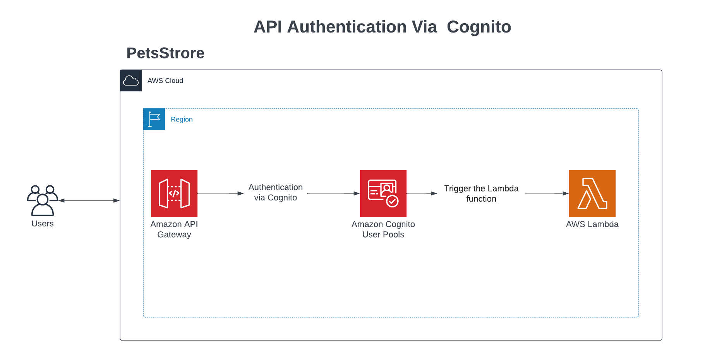

# AWS Lambda, API Gateway, and Cognito

## The Design:

**Task:**
Imagine creating an API for a pet store. We aim to authorize and authenticate users before granting them access to view the list of available pets.

**Solution:**\
**Functional Requirements:**

**API:** Pet store API.\
**API endpoint:** A single endpoint listing all available pets in the store.\
**User:** Access the API endpoint using a token for authorization.\
**User:** Able to sign up and sign in to obtain the access token.\
**Authorizer:** Responsible for authorizing and authenticating user functionality.

We will use AWS service. We will choose a region and create API gateway for user to pull the list of pets.\
A serverless Lambda function will act as an API.\
An API gateway will be in the front for the user to interact with the API (API = Lambda function.)\
Cognito will work as an authorizer with "Cognito Hosted UI" as interface for sign in and sign up.

## Implementation:

1. **Serverless Function (AWS Lambda):**

   - **Create a New Lambda Function:**

     - In the AWS Lambda console, click on "Create function."
     - Choose "Author from Scratch."
     - Set the name to "getPets," choose Node.js as the runtime, and create the function.

   - **Write Lambda Function Code:**
     - In the "Function code" section, copy the source code from the file `getPets.mjs`. This function returns a JSON response with an array of pets.

2. **API Configuration (AWS API Gateway):**

   - **Create a New API Gateway:**

     - In the AWS API Gateway console, click on "Create API."
     - Choose "REST API."

   - **Create Resource and Method:**
     - Add a resource and a method (GET) to your API.
     - Click the "Create method" button.
     - Choose "Method type" GET.
     - Choose "Integration type" Lambda.
     - From the "Lambda function" list, choose `getPets`.

3. **User Authentication (AWS Cognito):**

   - **Create a User Pool in Cognito:**
     - In the AWS Cognito console, click on "Manage User Pools."
     - Create a new user pool.
     - Under "Cognito user pool sign-in options," select "Email" as we will use email and password for sign up. Then click next.
     - Under "Multi-factor authentication," choose "No MFA." It's less secure, but MFA is not required by the task in hand. Then click next.
     - Click next again.
     - Under "Email provider," select "Send email with Cognito." Then click next.
     - Name your user pool "userPool-Authorizer."
     - Enable "Use the Cognito Hosted UI" under "Hosted authentication pages" as we are going to use this page for sign up and getting the authentication token later.
     - Under "Domain," select "Use a Cognito domain" and enter a domain prefix "pets-store-auth."
     - Under "App Client name," name your app "petsStoreAuthAppClient."
     - Select "Generate a client secret" as the client secret is used by the server-side component of the app to authorize API requests.
     - Under the URL, choose a redirect URL after sign-in and sign-up. For demo purposes, use "example.com" as a callback URL.
     - Expand "Advanced app client settings."
     - Under "OAuth 2.0 grant types," select "Implicit grant" as we will use this to generate access tokens, aka authentication tokens.
     - Click next.
     - Review all the options you have created, then click "Create user pool." We will come back and edit these options later.

4. **App Integration (AWS API Gateway + AWS Cognito):**

   - **Integrate the App "petsStoreAuthAppClient":**
     - In the AWS Cognito console, select "user pool," then select "userPool-Authorizer," then click the "App integration" tab.
     - Click "Create resource server."
     - Give a friendly name to the resource server (e.g., "petsStoreAPI").
     - Copy the API gateway endpoint from "Stages" in the AWS API Gateway console.
     - Paste the endpoint in the resource server identifier.
     - Add a custom scope for easy identification of the resource server. Scope name: read, and description: read.
     - Click "Create a resource server."
     - Go back to the app client and edit the "Hosted UI."
     - Select the custom scope "read," then save.
     - Return to the AWS API Gateway console, then to your API, and select "Authorizer."
     - Name the authorizer "CognitoAuthorizer."
     - From "Cognito User Pool," choose "userPool-Authorize."
     - In the "Token Source field," write "Authorization" without quotation marks.
     - Save.
     - Go to resources and select GET.
     - Select "Method Request" and edit it.
     - Select "Authorization," then select "CognitoAuthorizer."
     - In OAuth Scopes, type "email."
     - In OAuth Scopes, type the custom scope, i.e., API gateway endpoint + `/read` (e.g., https://url/read).
     - Save.
     - Deploy the API to the same stage.

## Testing:

1. **Unit Test:**

   - **Clone the GitHub Repository:**

     - Clone this GitHub repository to your local machine.

   - **Navigate to the Cloned Repo:**

     - Open a terminal and navigate to the cloned repository.

   - **Install Dependencies:**

     - Run `npm i` in the terminal to install dependencies.

   - **Run Tests:**
     - Execute `npm test` in the terminal to run the unit tests.

2. **API Test:**

   - **Not Authorized Test:**

     - Use a tool like Postman to test the API.
     - The API endpoint will return `{ "message" : "Unauthorized" }`.

   - **Authorized Test:**
     - Open the Hosted UI and follow the sign-up process.
     - Sign in with your email and password. You will be redirected to `sample.com`.
     - Open the Hosted UI, then edit and change the URL parameter `response_type` from "code" to "token."
     - In the new URL, copy the `#access_token`.
     - In Postman, under headers, add a key "Authorization" and paste the `#access_token` as a value.
     - Test. You should see a JSON response with an array of pets.
